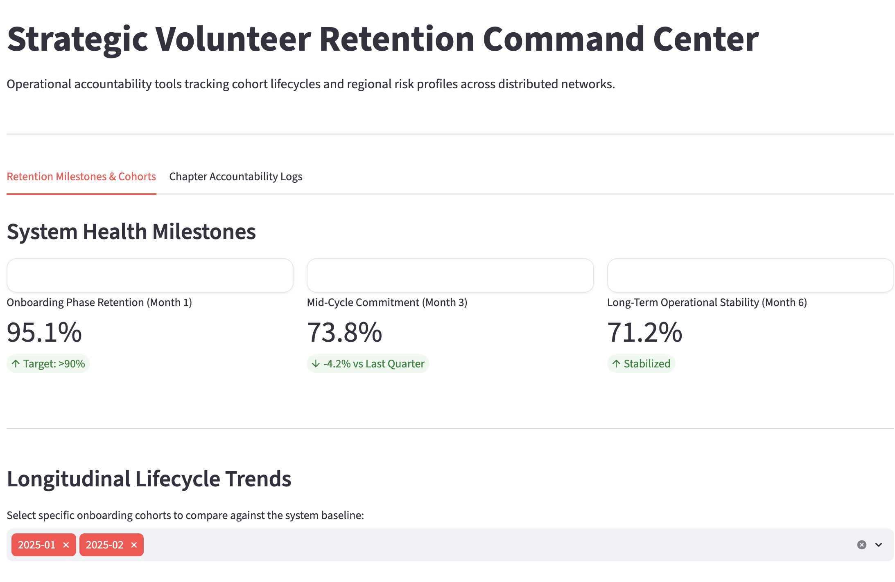

# Strategic Volunteer Retention & Operational Analytics Platform

**Live Dashboard Link:** [](https://yani-iben-data-driven-strategy-for-reducing-dashboardapp-rdl4xw.streamlit.app/)


An enterprise-grade, full-stack data warehousing and intelligence application engineered to expose structural churn points, monitor cohort lifecycles, and deliver regional chapter accountability metrics. 

This platform processes over **137,000 active service logs** to transform raw transactional database tracking into intuitive, executive-ready operational strategies.

---

## System Architecture & Data Pipeline

The infrastructure is built using decoupled, scalable components to transition workflows smoothly from local orchestration to fully managed cloud infrastructure:

1. **Orchestration Layer:** Python-based ETL pipelines process raw comma-separated transactional activity, cleaning records and mapping dimensions natively.
2. **Data Warehouse Layer:** A hosted **PostgreSQL (Neon Cloud Cluster)** database optimized with targeted B-tree lookup indexes (`idx_activity_engagement`) and materialized analytics views to eliminate query lag.
3. **Application Layer:** An interactive, modern **Streamlit Cloud** frontend running asynchronous data-frame caching pipelines to fetch server-side aggregates in milliseconds.

---

## Analytical Core Features

### 1. Cohort Retention Heatmap Matrix & Curves
* **The Onboarding Cliff:** Isolates the percentage drop-off between Month 0 and Month 1 across historical cohorts to evaluate initial training and orientation efficacy.
* **Un-Spaghetti Trend Mapping:** Utilizes interactive multi-select filters allowing stakeholders to isolate and benchmark specific onboarding waves against a rolling system baseline.

### 2. Distributed Chapter Accountability Logs
* **Operational Risk Matrix:** Tracks under-performing chapters by compiling real-time "At-Risk User Headcounts" (volunteers dropping below an engagement threshold of 4/10).
* **SaaS KPI Scorecards:** Delivers high-level summaries including active region counts and mean system engagement scores to guide regional resource allocation.

---

## Tech Stack & Dependencies

* **Frontend:** Streamlit, Streamlit Secrets (TOML Vault)
* **Visualizations:** Plotly Express (Interactive WebGL Vector Canvases)
* **Database & ORM:** PostgreSQL, SQLAlchemy, Psycopg2
* **Data Processing:** Pandas, NumPy

---

## Local Development Installation

To run this project locally on your machine, clone the repository and configure your local environment variables:

```bash
# 1. Clone the repository

# 2. Install core package dependencies
pip install -r requirements.txt

# 3. Initialize local environment variables or .streamlit/secrets.toml
# Ensure your database dialect points to: postgresql+psycopg2://...

# 4. Launch the local Streamlit development server
streamlit run dashboard/app.py